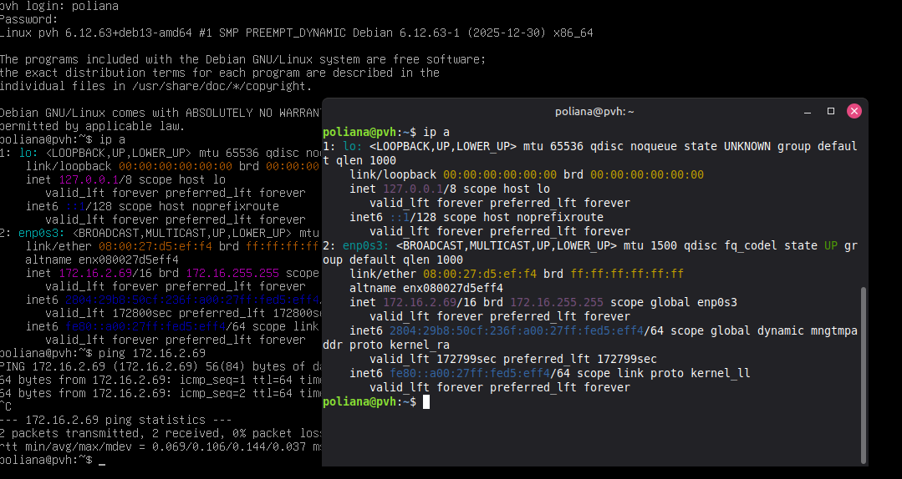

# Descrição 

O projeto final consiste em criar uma VM (_virtual machine_) com alguma distribuição GNU/Linux. \
Além de outros requisitos como: servidor `ssh`, servidor `HTTP`, incluir no mínimo dois `scripts CGI` e placa em modo _bridge_.\
Por fim, definir o endereço de IP, _gateway_ e servidor DNS de acordo com a planilha
> Para este trabalho escolhi o Debian 13.

## Desafios

1. Para instalação da maquína em ambiente doméstico, foi necessário usar a rede em modo **NAT**
    - Após a instalação do `openssh-server` e `apache2`. Adicionei uma "rede fantasma":
        ```bash
        ip link show #lista e exibe o estado das interfaces de rede.
        ```
        > Procura-se uma rede com: `state UP`

        Adicione uma nova rede:
        ```bash 
        sudo ip addr add 172.16.1.100/16 dev wlp0s20f3
        ```
        > Adiciona temporariamente o IP `172.16.1.100/16` à interface `wlp0s20f3` para permitir comunicação com a rede `172.16.0.0/16` sem alterar a configuração principal.

    - Mude a rede do modo *NAT* para **Placa em modo bridge**, selecione a interface que foi configurada com o novo IP e permita tudo no _Promiscuos Mode_ 

2. Configurar o `/etc/network/interfaces`:
a. Comente as linhas com `allow-hotplug` e `dhcp`

    ```nano
    # The primary network interface
    auto enp0s3
    iface enp0s3 inet static
        address 172.16.2.69 #ip desejado
        netmask 255.255.0.0 # mascara correspondente a /16
        gateway 172.16.1.254 # gateway desejado
        dns-nameservers 8.8.8.8 # dns server desejado
    ```

Por fim, digite `reboot` na máquina para garantir a alteração.\
Faça conexão `ssh`tranquilamente:



