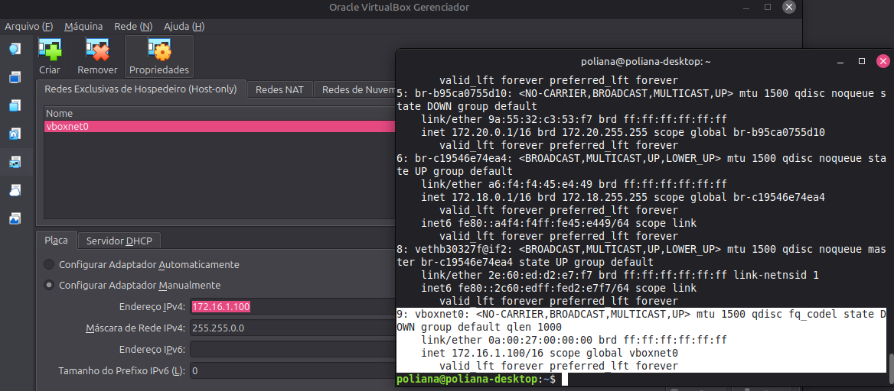

# Descrição 

O projeto final consiste em criar uma VM (_virtual machine_) com alguma distribuição GNU/Linux. \
Além de outros requisitos como: servidor `ssh`, servidor `HTTP`, incluir no mínimo dois `scripts CGI` e placa em modo _bridge_.\
Por fim, definir o endereço de IP, _gateway_ e servidor DNS de acordo com a planilha
> Para este trabalho escolhi o Debian 13.

# Sumário

1. [Configurar IP fixo com apenas um adaptador no modo _brigde_](#configurar-ip-fixo-com-apenas-um-adaptador-no-modo-brigde)
2. [Segmentação de Rede: Acesso Externo (NAT) e Rede de Avaliação (Host-Only)](#segmentação-de-rede-acesso-externo-nat-e-rede-de-avaliação-host-only)

## Configurar IP fixo com apenas um adaptador no modo _brigde_

1. Para instalação da maquína em ambiente doméstico, foi necessário usar a rede em modo **NAT**
    - Após a instalação do `openssh-server` e `apache2`. Adicionei uma "rede do hospedeira":
        ```bash
        ip link show #lista e exibe o estado das interfaces de rede.
        ```
        > Procura-se uma rede com: `state UP`

        Adicione uma nova rede:
        ```bash 
        sudo ip addr add 172.16.1.100/16 dev wlp0s20f3
        ```
        > Adiciona temporariamente o IP `172.16.1.100/16` à interface `wlp0s20f3` para permitir comunicação com a rede `172.16.0.0/16` sem alterar a configuração principal.

    - Mude a rede do modo *NAT* para **Placa em modo bridge**, selecione a interface que foi configurada com o novo IP e permita tudo no _Promiscuos Mode_ 

2. Configurar o `/etc/network/interfaces`:
a. Comente as linhas com `allow-hotplug` e `dhcp`

    ```nano
    # The primary network interface
    auto enp0s3
    iface enp0s3 inet static
        address 172.16.2.69 #ip desejado
        netmask 255.255.0.0 # mascara correspondente a /16
        gateway 172.16.1.254 # gateway desejado
        dns-nameservers 8.8.8.8 # dns server desejado
    ```

Por fim, digite `reboot` na máquina para garantir a alteração.\
Faça conexão `ssh`tranquilamente:


## Segmentação de Rede: Acesso Externo (NAT) e Rede de Avaliação (Host-Only)

Neste formato é necessário habilitar dois adaptadores de rede: **NAT**, **Placa Host-only**
> Inclui-se um terceiro (não conectado) para meios acadêmicos.
Ao utilizar esse método, ao instalar o Debian, deve-se configurar a rede. Serão apresentadas as placas de rede disponíveis e por padrão, selecionei a enps0s3 para ser configurada em DHCP.

> **Nota sobre Interface Names**: As interfaces foram identificadas como enp0s3 e enp0s8 seguindo o padrão de nomes previsíveis do sistema, onde o sufixo indica o slot de barramento virtual (ex: Slot 3 para NAT e Slot 8 para Host-Only).

- No VirtualBox adicione uma rede `vboxnet0`
    > Ela virá, provavelmente, no padrão `192.168.xx.x`

    - Na sua máquina física procure pela interface de rede `vboxnet0`:
        ```bash
        ip addr show vboxnet0
        ```
    - Altere o endereço de IP temporariamente ao utilizar a vm:
        ```bash
        sudo ip addr flush dev vboxnet0 && sudo ip addr add 172.16.1.100/16 dev vboxnet0
        ```
        > Esse comando vai limpar a interface de rede e depois adicionar um novo IP. Este IP, vai ser responsável pela comunicação de 172.16.x.xx 
    
    
    - Ajuste a rede do VirtualBox:
        

    - Execute a VM e configure o arquivo `/etc/network/interfaces` para poder fazer conexão via `ssh` com o ip desejado:
        ```nano                     
        # This file describes the network interfaces available on your system
        # and how to activate them. For more information, see interfaces(5).

        source /etc/network/interfaces.d/*

        # The loopback network interface
        auto lo
        iface lo inet loopback

        # Interface NAT
        auto enp0s3
        iface enp0s3 inet dhcp

        # Interface Host-only
        auto enp0s8
        iface enp0s8 inet static
                address 172.16.2.69
                netmask 255.255.0.0

        # Adaptador 3: Não conectado (Requisito acadêmico)
        auto enp0s9
        iface enp0s9 inet manual

        # The primary network interface
        # allow-hotplug enp0s3
        # iface enp0s3 inet dhcp
        # This is an autoconfigured IPv6 interface
        # iface enp0s3 inet6 auto
        ```
        > Reinicie a máquina com o comando `reboot`.

Por fim, verifique com o comando `ping` o novo IP em enp0s8, e faça a conexão ssh.


